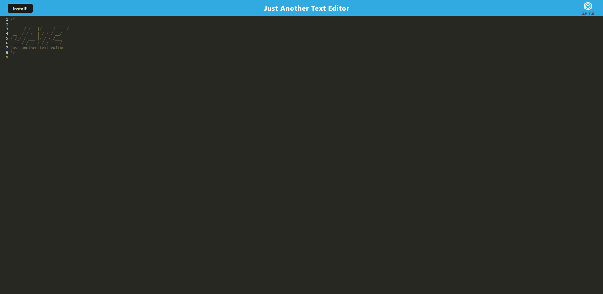

# PWA-Text-Editor-ShaneWilmes

## Table of Contents:
  [Description](#Description) 
  [Installation](#Installation)
  [Tests](#Tests)
  [Usage](#Usage)  
  [GitHub](#GitHub)
  [E-mail](#E-mail)
  [Contributing](#Contributing)
  [License](#License)  

## Description
PWA/Progressive Web Application.  This app can download a text editor to make notes in.  Additionally, it features a number of data persistence techniques that serve as redundancy in case one of the options is not supported by the browser. The application will also function offline.

## Screenshot

## Technologies
- HTML5
- JavaScript
- Node.js
- Express.js
- IndexedDB
- Day.js
- Heroku

## My GitHub
[ShaneWilmes](https://github.com/ShaneWilmes/PWA-Text-Editor-ShaneWilmes)

## E-mail
shanewilmes@yahoo.com

## Usage
[On Heroku](https://text-editor-sww.herokuapp.com/)
Click Install

## Contributing
Make a pull request with comments or questions.
[Project Repo](https://github.com/ShaneWilmes/PWA-Text-Editor-ShaneWilmes)

## License
[MIT]()

    